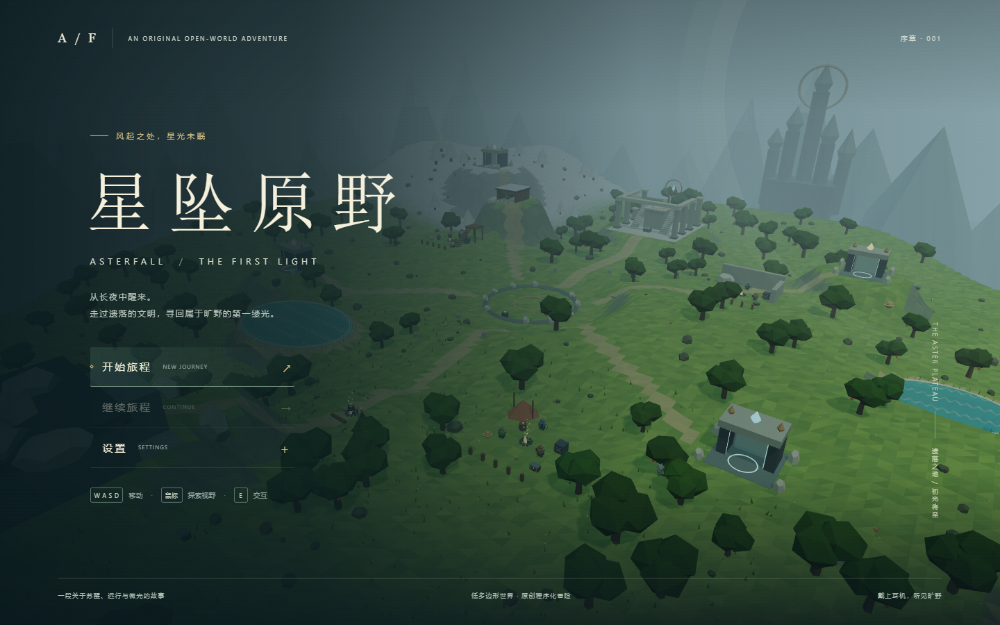

# 星坠原野 · Asterfall

一款原创、浏览器端、低多边形开放世界动作冒险垂直切片。以探索、攀爬和系统交互为核心，从回声密室走向四座遗迹，再获得风帆飞离台地。

**所有模型、地形、图案、界面和声音均由项目代码程序化生成。** 不包含任天堂或其他游戏的模型、地图、贴图、字体、音乐、对白或音效；这不是官方作品，也不是地图复刻。



## 运行

需要 Node.js 20.19+ 或 22.12+，以及启用 WebGL / 硬件加速的现代桌面浏览器。

```bash
npm ci
npm run dev
```

打开终端显示的本地地址。发布构建及预览：

```bash
npm run build
npm run preview
```

`dist/` 为可部署到静态网站的产物，使用相对资源路径，适合子目录部署。请使用 HTTP 服务器，不要直接双击 HTML 文件。首次安装需要网络，运行时不请求外部美术、字体或音频资源。

## 操作

| 操作 | 键位 |
| --- | --- |
| 移动 / 冲刺 | WASD / Shift |
| 旋转镜头 | 点击场景锁定鼠标后移动鼠标 |
| 跳跃 / 抓墙攀爬 | Space |
| 展开风帆 | 取得风帆后，在下落中按住 Space |
| 蹲伏 | C / Ctrl |
| 交互、拾取、开箱 | E |
| 近战 / 蓄力 | 鼠标左键 / 按住后松开 |
| 锁定 / 举盾 | 鼠标右键 |
| 盾反 | 举盾时 G |
| 闪避 | 锁定时侧向或后退 + Space |
| 拉弓 / 射箭 | 按住 R / 松开 R |
| 投掷武器 / 释放能力目标 | Q |
| 使用能力 | F |
| 切换四种能力 | 1 / 2 / 3 / 4，或按住 B 移动鼠标、松开确认 |
| 取消能力轮盘 | Esc，或回到轮盘中心后松开 B |
| 炸弹形状 | V |
| 调整磁力目标距离 | 滚轮 |
| 背包 / 地图 / 任务 | Tab / M / J |
| 暂停 / 返回 | Esc |
| 跳过演出 | Enter / Space / E / Esc |

物品需在背包中装备后使用。游泳时不能使用近战；双手重武器不能同时举盾。初次点击场景会申请鼠标锁定，按 Esc 释放。界面按钮不需要锁定鼠标。

## 旅程指引

1. **回声密室**：可选取两件衣物；领取发光台座上的星盘，用它打开石门。出口矮墙教学跳跃与攀爬。
2. **初光崖与旅人**：洞口记录安全存档。山坡下营火边的白发旅人会给出方向；附近可找到基础装备和食材。
3. **观星之塔**：在台地中央激活基座，下载区域地图。地图上的四座遗迹可以任意顺序探索。
4. **四座遗迹**：入口下载能力不是完成试炼；必须实际解开三道机关，才可在终点领取星核。能力也可带回旷野使用。
5. **御寒**：西北雪山寒冷。将辣椒与食物一起烹饪可获得限时抗寒，也可寻找防寒衣。准备食物后再爬山。
6. **无名者圣所**：集齐四枚星核后前往台地北侧的圣所，选择生命或精力成长；随后攀上高台与旅人交谈，取得风帆。
7. **走向远方**：从台地边缘跳下，按住 Space 滑翔飞越边界。序章完成后仍可自由探索。

### 试炼思路

- **牵星**：抬起金属板、把两个方块沉入坑内光环并亲自过桥、拉开金属门后挥动金属撞击守卫。按 F 吸附，再次按 F 或 Q 释放，滚轮调距。
- **鸣爆**：炸开裂纹石壁、用球形炸弹通过管道，再把炸弹放到弹射台，等它飞近石球时遥爆推动石球撞墙。炸弹会伤害自己，放下后退到红圈外。
- **凝时**：冻结运动机关后通过；冻结阻路球体，攻击它积累冲量，解冻后释放。不同目标的冻结时长不同。
- **霜阶**：瞄准开阔水面或瀑布，蓝色预览表示可造柱。用冰柱渡水、顶起栅门、登上高处；最多三根，继续生成会移除最早的一根。

## 存档与设置

- 版本化 JSON 存放在当前浏览器、当前站点的 `localStorage`。换浏览器、端口或网站域名不会共享存档。
- 关键进度自动保存，暂停页可手动保存；战斗中禁止手动保存。
- 死亡后可读取最近记录。读档位置无效、在深水中或陷入地形时，使用安全位置恢复。
- 损坏的存档不会让页面白屏；可开始新旅程，或通过开发调试面板清除测试存档。
- 提供画质、音量、镜头灵敏度、镜头晃动、字幕和色弱高亮设置。
- 页面失焦会暂停，恢复后不会一次模拟后台积累的时间。

## 开发与测试

```bash
npm test
npx playwright install chromium
npm run test:e2e
npm run build
npm run test:production
npm audit --audit-level=moderate
```

单元测试覆盖物品、战斗、角色控制、四能力、地形、存档和血月规则。浏览器测试使用 Chromium / Playwright：常规输入测试使用真实浏览器键盘和帧循环；完整通关用例在浏览器中按固定 60Hz 驱动相同的玩法模块，在关键节点渲染截图。它通过键盘事件移动角色、穿越碰撞体和解开机关，不传送、不改任务进度、不生成奖励。为准确瞄准，测试设置受游戏限制的相机角度，并用实际对话与背包回调操作菜单。

单独的边界用例允许构造满背包、损坏/深水存档等测试场景。生产测试访问 `dist/`，确认没有开发调试接口，且资源加载和菜单正常。测试产物位于被 Git 忽略的 `.artifacts/`、`test-results/`、`test-results-production/`；详细记录见 [验证报告](docs/QA.md)。GitHub Actions 在 push / PR 时运行上述测试并保留浏览器证据。

CI 的共享软件渲染环境使用游戏正常提供的「流畅」画质和 1280×720 窗口；本地默认测试为均衡画质、1440×900。降低画质只调整渲染，不改变玩法、碰撞、伤害或存档规则。

开发服务器提供隐藏的调试功能（反引号键）；生产构建不提供调试接口。正常完成序章不需要调试工具。

## 已实现系统

- 完整密室、星盘、开门、全景、老人、高塔、四遗迹、成长选择和风帆结局；演出可跳过，关键奖励防重复。
- 三类营地敌人和遗迹守卫，警觉、追击、攻击、硬直、死亡、掉落；近战、蓄力、锁定、盾反、正确时机闪避触发专注时间、弹道箭与投掷武器。
- 地面碰撞与台阶、攀爬与雨滑、游泳与溺水救援、滑翔、坠落伤害、生命与精力。
- 四种可在旷野复用的能力，每座遗迹三道实际机关；磁力桥与守卫碰撞、炸弹管道与空中遥爆、静止蓄力、冰柱渡水与顶门。
- 苹果摇落和攻击打落、采集、伐木成原木再劈成木材、装备耐久、满槽保护、普通/营地/能力宝箱、材料烹饪及抗寒和恢复效果。
- 昼夜、雨雪、局部火焰、绯月复苏、地图与持久标记、分类背包、设置、暂停、死亡读档和自动/手动记录。
- 分块地形、实例化植被、池化箭矢与特效、合成音频，以及画质、字幕和高辨识配色设置。

## 工程组织

- `src/app/`：游戏循环、生命周期和模块集成。
- `src/core/`：共享协议、输入、存档、时间和池化特效。
- `src/config/`：集中参数、地点、任务和物品定义。
- `src/world/`：程序化地形、建筑、采集物、天气与昼夜环境。
- `src/player/`：移动、碰撞、攀爬、游泳、滑翔及第三人称相机。
- `src/combat/`：武器、敌人、弓箭、盾反与专注时间。
- `src/abilities/`：四种能力与四座试炼。
- `src/interaction/`、`src/quests/`：交互、背包、烹饪、生存与剧情。
- `src/ui/`、`src/audio/`：HTML/CSS 界面与 Web Audio 合成声音。

## 原型边界

这是压缩尺度的程序化垂直切片，不是商业级完整开放世界。角色动画为层级几何体动画；物理采用自定义角色控制、盒体与连续射线检测，而非通用刚体模拟；敌人路径与群体协作、材质、演出及声音采用适合原型的简化表达。不提供多人游戏、移动触控、完整手柄适配、真实骨骼 IK 或商业游戏级资产。

优先保证桌面键鼠、主线可完成、系统可交互与持久化可靠。软件 WebGL、集成显卡或高分屏可以在设置中降低画质。

其他简化：剧情用短镜头和字幕呈现，未做完整表情/口型演出；敌人使用局部避障，未使用全地图导航网格；碰撞物不会进行通用刚体堆叠；雪山与主线地图为压缩尺度；天气、声音和火焰采用有限范围的程序化表达。没有完整电元素、骑乘、狩猎、可重映射键位或增强项。性能目标取决于显卡，软件 WebGL 测试不能代表普通桌面 GPU 的 60 FPS 表现。
