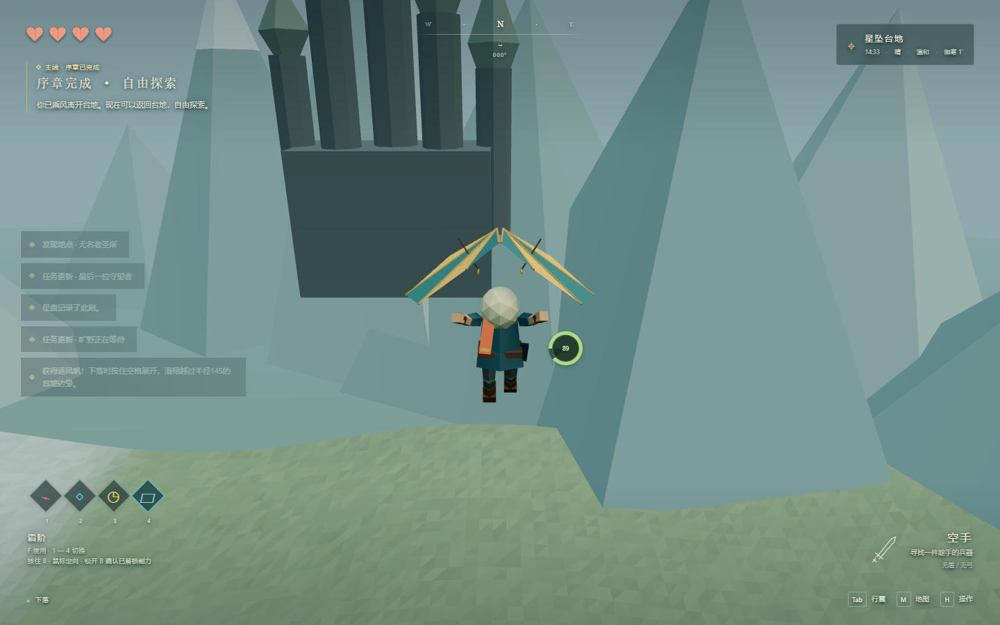

# 验证记录

测试环境：Windows / Node.js 24.9.0 / Chromium（Playwright，SwiftShader 软件 WebGL）。日期：2026-09-12。

## 结果

- 生产构建通过，TypeScript 无错误。
- 116 项单元测试通过（7 个测试文件）。
- 10 项开发浏览器场景均已通过：整套首轮 9/10；把移动断言从固定延时改为等待真实位置变化后，相关文件 4/4 复测通过。
- 完整新存档通关通过，完成后刷新继续验证通过。
- 生产页面回归通过，未检测到脚本/控制台错误或资源请求失败。
- 依赖审计：0 个已知漏洞。

## 方法

- `npm test`：Vitest 在真实玩法模块上验证战斗、物品、任务、存档、地形、移动与能力规则。
- `npm run test:e2e`：浏览器标题/菜单、主线、异常存档和生命周期回归。
- `npm run build`：TypeScript 检查和 Vite 生产打包。
- `npm run test:production`：独立 HTTP 预览 `dist/`，检查启动、移动、菜单、窄窗口、资源请求、控制台以及开发接口移除。
- `npm audit --audit-level=moderate`：依赖漏洞检查。

完整通关测试从新存档开始，通过真实输入事件驱动角色移动与机关操作；它在浏览器内以固定 60Hz 调用实际玩法模块，关键节点渲染截图，避免软件 WebGL 把数十分钟的主线验证拖得更长。它不修改任务完成状态、不生成奖励、不传送角色、不关闭伤害或碰撞。瞄准使用游戏允许范围内的相机角度；背包和对话使用实际菜单回调。另有独立的真实时间键盘流程覆盖密室到高塔。异常场景用例会显式构造测试存档和背包状态。

## 覆盖范围

| 范围 | 验证内容 |
| --- | --- |
| 主线 | 密室衣物、终端、开门、攀出洞口、老人、高塔与安全下降、四遗迹、料理、御寒、成长、风帆、越界结局、刷新继续 |
| 四遗迹 | 金属板、双方块过桥、金属门与守卫碰撞；裂墙、球弹管道、弹射遥爆；冻结转台与滚石、两次有效击打积蓄冲量；冰柱渡水、顶门和高台 |
| 任务与物品 | 提前交互不发奖励、重复奖励防护、两种成长选项、满槽重试、配方与失败料理、耐久、烹饪中断返还、苹果摇落、原木再劈木材 |
| 战斗 | 单次挥击只结算一次、切装/暂停/死亡取消攻击、盾反、双手武器限制、正确闪避专注时间、弓箭、投掷与掉落、敌人遮挡感知 |
| 移动 | 台阶、低顶、薄墙、攀爬翻越、雨滑、移动支撑、精力、游泳上岸、冰柱下方生成、滑翔耗尽、坠落伤害、镜头避障 |
| 存档与世界 | 损坏或不可访问的 localStorage、深水安全点恢复、死亡界面、暂停箭矢、后台超大时间差、读档清理飞行物、绯月延期与关键奖励保留 |
| 生产交付 | 无开发调试接口、无阻断性脚本错误、静态资源正常、菜单和窗口缩放可用 |

## 本轮修复

1. 修正地形缓冲区属性类型，恢复 TypeScript 生产构建。
2. 将金属移动物的伤害节流绑定到真实接触，修复空挥占用冷却导致撞击守卫漏判；限制对交互道具的重复接触伤害。
3. 在创建角色前校验读档位置及安全点，修复两个点都在深水时反复溺水的问题。
4. 把木屋和雪山遗迹之间的山路坡度烘焙到渲染与碰撞共用的高度场，修复平坦地标边缘形成的陡坡卡路。
5. 对齐旧测试与完整玩法：苹果先落地、树木先成原木、高塔完成演出后下载地图、四遗迹要求实际解谜，避免把“下载能力”误认为通关。
6. CI 首轮发现键盘流程可能在领取终端的演出开始前发送跳过；测试现在等待演出实际开始再发送按键，消除不同渲染帧率导致的竞态。
7. 云端负载较高时，固定毫秒等待不足以保证完成一帧；移动、演出和放弹测试改为等待真实状态。CI 使用公开的流畅画质和 1280×720 窗口，本地均衡画质验证仍保留。

## 验证边界

这是一款压缩尺度的低多边形原型。软件 WebGL 的通过结果不等于桌面 GPU 的 1080p / 60 FPS 性能认证；没有进行多品牌显卡、Firefox/Safari、移动触控或手柄兼容性验证。完整自动通关覆盖一种正常解法与一种试炼顺序，不代表穷举所有自由玩法组合。敌人导航、刚体接触、演出和动画采用原型规模实现，详见 README。

测试截图、失败追踪和报告输出到 Git 忽略目录。CI 会上传当次浏览器证据，不将本机历史调试文件发布到仓库。
